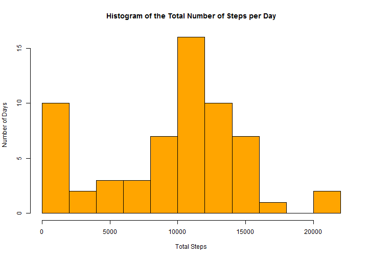
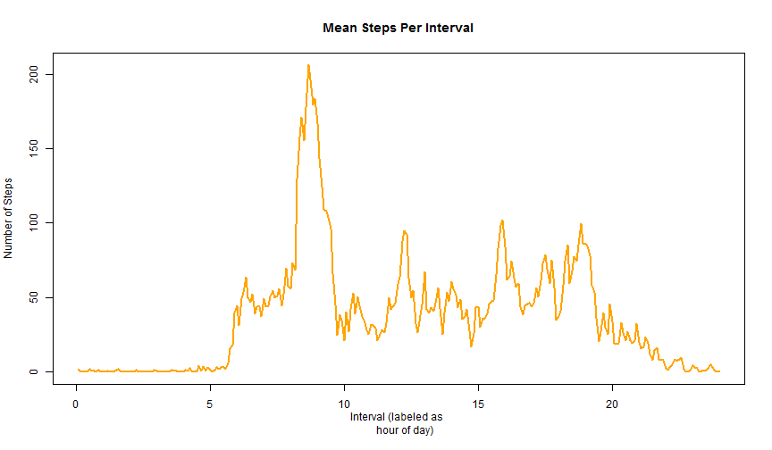
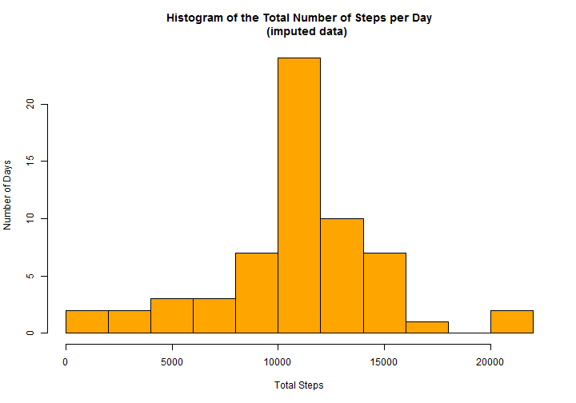
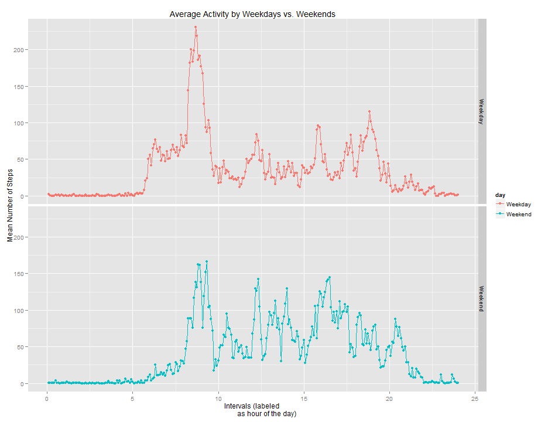

This document contains the analysis and report for **Reproducible Research: Peer Assessment 1** as submitted by github user *schweitzerb*.  
  
  <br />  
  
## Loading and preprocessing the data
This analysis will make use of the *plyr* and *ggplot2* packages. The activity.csv file needs to be unziped before starting.  
After reading the data, the columns are converted to a type apropriate for further analysis.


```r
### Libraries
library(plyr)
library(ggplot2)

### Read Data
stepsData <- read.csv("activity.csv")

### Prepare Variables
stepsData$date <- as.POSIXct(as.character(stepsData$date),format = "%Y-%m-%d")
stepsData$interval <- sprintf("%04d",stepsData$interval)
stepsData$interval <- as.ordered(stepsData$interval)
```

<br />
## What is mean total number of steps taken per day?
First, we aggregate the data by date, ignoring the missing values for this part of the analysis. 

Using the aggregated data, we can then produce a histogram of the total number of steps per day and calculate the mean and median number of steps per day.


```r
### Aggregate the number of steps by date
stepsByDay <- ddply(stepsData,"date",summarise,total=sum(steps,na.rm=T),
                    mean=mean(steps,na.rm=T),median=median(steps,na.rm=T))

###Calculate the mean and median number of total steps per day
meansteps <- mean(stepsByDay$total)
medianSteps <-median(stepsByDay$total)

###Plot the histogram of the total number of steps per day
hist(stepsByDay$total,breaks=10,main="Histogram of the Total Number of Steps per Day",
     ylab="Number of Days",xlab="Total Steps",col="orange")
```

 

The histogram shows an approximately normal distribution of the total number of steps per day (with some outliers). The **mean number of steps per day** is *9354.2295* and the **median number of steps per day** across the observation period is *10395*.

<br />
## What is the average daily activity pattern?
In order to investigate the daily activity pattern, we will aggregate the data by the 5-minute intervals across all days, and produce a plot of the activity of the "average day".


```r
### Aggregate steps by interval
stepsByInterval <- ddply(stepsData,"interval",summarise,total=sum(steps,na.rm=T),
                         mean=mean(steps,na.rm=T),median=median(steps,na.rm=T))

###Find the interval with the highest average number of steps
maxSteps <- stepsByInterval$interval[which.max(stepsByInterval$mean)]
maxSteps_time <- format(strptime(maxSteps, format="%H%M"), format = "%H:%M")

### Plot the daily activity pattern
plot(as.numeric(stepsByInterval$interval)/288*100/4.16667,stepsByInterval$mean,type="l",
     main="Mean Steps Per Interval", ylab="Number of Steps",xlab="Interval (labeled as 
     hour of day)",col="orange",lwd=2)
```

 

The timeseries plot provides a good overview of the movement activity over the course of the average day. There is a big spike of activity in the morning (between 8am and 10am), and a clearly distinguishable resting state during the night (from midnight to just past 5am).

The 5-minute **interval with the highest average number of steps** is *0835*, corresponding to *08:35am*. This is consistent with the information gleaned from the plot.

<br />
## Imputing missing values
A quick look at the data shows us that there are multiple large chunks of missing values in the data set. In **total**, there are *2304* **rows with missing information**.  

In order to see if these missing values have an impact on the analysis, we will impute the *NA* values for each interval by taking the average of the number of steps corresponding to that interval across all days. We can then compare the imputed data to the original data set.


```r
###Create a vector with the indices of all the missing values
missingIndex <- which(is.na(stepsData$steps))

###Copy the original data set
stepsImputed <- stepsData

###Run through the new dataframe and replace all NA's with the corresponding average calculated earlier
for (i in 1:length(missingIndex)){
      matchInterval <- stepsImputed[missingIndex[i],3]
      stepsImputed[missingIndex[i],1] <- stepsByInterval[stepsByInterval$interval
                                                         ==matchInterval,3]
}

###Calculate some stats with the imputed data
stepsByDay_imputed <- ddply(stepsImputed,"date",summarise,total=sum(steps,na.rm=T),
                            mean=mean(steps,na.rm=T),median=median(steps,na.rm=T))
meanstepsI <- mean(stepsByDay_imputed$total)
medianStepsI <-median(stepsByDay_imputed$total)

###Histogram of the total number of steps per day
hist(stepsByDay_imputed$total,breaks=10,main="Histogram of the Total Number of Steps per Day
     (imputed data)",ylab="Number of Days",xlab="Total Steps",col="orange")
```

 

The histogram shows a notebale drop in the number of days with less than 2500 steps (and a corresponding increase in days over 10000 steps). It seems that in the original analysis, the missing data caused multiple days to have very low step totals. This confirms our initial, cursory observation that the the missing values appeared in large chunks, rather than randomly throughout the data. Hence, imputing the missing data with the averages from the available data noteably increased the total number of daily steps for those days which had large amounts of missing values.

Consequently, the mean and median number of steps per day also increased:
- **Mean:** 1.0766 &times; 10<sup>4</sup> (imputed) vs. 9354.23 (original)
- **Median:** 1.0766 &times; 10<sup>4</sup> (imputed) vs. 1.0395 &times; 10<sup>4</sup> (original)

Additionally, the mean and median in the imputed data converged to the same number, as there is now a large number of days with exactly the mean number of total steps. 


<br />
## Are there differences in activity patterns between weekdays and weekends?
Finally, using the imputed data, we want to investigate the difference in activity pattern between weekday and weekends. 


```r
###Add a new factor which codes the date by whether it is a weekend or weekday 
stepsImputed$day <- weekdays(stepsImputed$date)
stepsImputed$day <- with(stepsImputed, replace(day,day%in%c("Saturday","Sunday"),"Weekend"))
stepsImputed$day <- with(stepsImputed, replace(day,!(day%in%"Weekend"),"Weekday"))
stepsImputed$day <- as.factor(stepsImputed$day)

###Calculate the mean number of steps per interval for weekdays and weekends
ByWeekday <- ddply(stepsImputed,c("interval","day"),summarise,total=sum(steps,na.rm=T),
                   mean=mean(steps,na.rm=T),median=median(steps,na.rm=T))

###Plot the activity patterns for weekdays and weekends
panels <- qplot(as.numeric(interval)/288*100/4.16667,mean,data=ByWeekday,facets=day~.,color=day,
                main="Average Activity by Weekdays vs. Weekends",xlab="Intervals (labeled 
                as hour of the day)",ylab="Mean Number of Steps")+
      geom_line(aes(group=day))

print(panels)
```

 

We can see that there are distinct differences in the activity patterns between weekdays and weekends. This means that we should consider revising our imputation method to account for this difference. 

